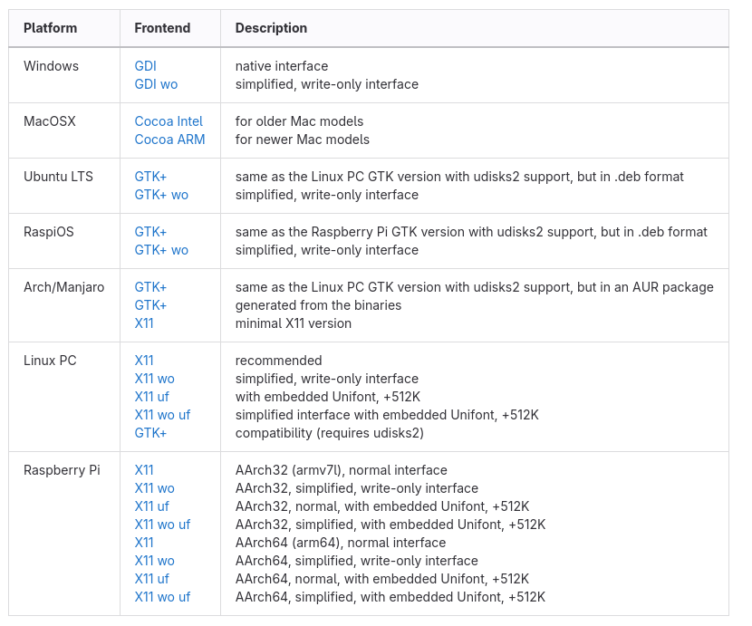

.. _PopInstall:

******************
PopOS Installation
******************
This section describes a process that can be used to install PopOS
on a computer system that uses a UEFI based hard drive, which is the most
comman type sold in standard Windows and Linux computers.  In addition,
these instructions assume that the reader has access to a working computer
to download some necessary files.

**NOTE:** This instructions in this section were crafted for a Dell XPS computer
that came pre-installed with Ubuntu Linux.  Their may be some extra steps not 
described in this document for someone using a computer that was pre-installed
with windows.  These steps will occur in the beginning of the process to
prepare the computer when in Bios mode prior to installation.  The reader
of this document should investigate these steps prior to beginning the process
as outlined in this document.

Pre-Installation Activities
===========================
Before we start the Arch Linux installation 
we need to download an Arch Linux iso file and flash the distribution to a 
thumb drive.

Download an ISO file.
---------------------
Navigate to the `PopOS <https://system76.com/pop/download/>`_ directory 
where you can see download options for different computer configurations.
As of hte date this document was written there are three options for Intel,
AMD chips with older NVIDIA grpahics cards, one for Intel, AMD chips with newer 
NVIDIA graphics cards, and one for Raspberry Pi boards.  Determine which 
option is applicable to you and click download.

Flash the Distribution to a Thumb Drive
---------------------------------------
Once the ``iso`` file has been saved to a thumb drive we need to flash the 
distribution to the drive so we can use it as a bootable drive for the 
installation process. There are several utility programs that can be used
to transform a thumb drive into a bootable drive, but I prefer to use 
`USB Imager <https://gitlab.com/bztsrc/usbimager>`_.  The following image
shows an example of the download options in these
`USB Imager <https://gitlab.com/bztsrc/usbimager>`_

Pick the option that is best suited to the computer you are using to the operating
system you are using to download and flash the thumb drive.  Once you click
on an option it should download an installer.  Once you have installed USB Imager 
you should have access to a GUI that looks like the image below.

.. image:: images/imager.png
   :alt: The USB Imager Graphical user Interface

It is usually best to leave the .iso file in the `Downloads` directory where it 
was placed when you retrieved it from the `PopOS Store <https://system76.com/pop/download/>`_
Next click on the three dots in the upper right icon to search for your thumb drive in
the filesystem.  Ensure that the verify button is checked, then click on
the Write icon.  This will start the process of flashing the ``.iso`` to the 
flash drive.  The entire process may take a few minutes to complete.  Once the 
process is complete, your thumb drive should be relabelled automatically to 
reflect the version of PopOS that was flashed to it.

Arch Linux Linux Installation 
-----------------------------
Now that the thumb drive has been flashed with the PopOS ``.iso`` file,
we are prepared to use it as a mechanism to install PopOS Linux on your computer.
Ensure that the computer is powered off, and insert the thumb drive into its interface 
with the computer.  Also, if possible try to complete this process with a hard 
link internet connection in case their are issues with wireless during the 
install process.

Boot your computer into the Bios mode by turning the computer 
on and then repetatively depressing the F12 key.  Once booted into Bios mode you
should see an option for different boot menus, to include a boot option for
your USB drive.  Click on this option, and it will boot from the flash drive. 
This boot option is commonly known as bpooting into live mode.  Once booted 
you should see several options, which may change from version to version; 
however; you should see an option for the following or something very similar.

.. code-block:: bash

   PopOS install medium (x86_64, UEFI)

Use the up or down arrow keys to navigate to this option if you are not 
already hovering on this option.  Click enter, and this will enter into
the Arch Linux installation process.

**NOTE:** The instructions listed above may not work for a computer that 
has a Bios tailored for windows.  There may be some bios options that you will
have to manually change, but these are beyond the scope of this document.

From this point on, the PopOS installer will guide you through the process.
I highly recomment clicking ``yes`` to the option for encrypting the hard drive.

